# Deployment Guide

This guide covers deploying both the backend API and frontend for Theme Park Hall of Shame.

## Live Site

- **URL**: http://themeparkhallofshame.com
- **Status**: Deployed and collecting data
- **Server**: ec2-user@webperformance.com
- **SSH Key**: `~/.ssh/michael-2.pem` (required for all SSH/rsync commands)

**CRITICAL: All SSH and rsync commands MUST use the SSH key pattern:**
```bash
ssh -i ~/.ssh/michael-2.pem ec2-user@webperformance.com "<command>"
rsync -av -e "ssh -i ~/.ssh/michael-2.pem" <local> ec2-user@webperformance.com:<remote>
```

## Quick Reference

| Documentation | Purpose |
|---------------|---------|
| **This file** | Overview and initial setup |
| [CLAUDE.md](../CLAUDE.md#production-deployment-configuration) | Deployment commands and monitoring |
| [database/REPLICATION_SETUP.md](../deployment/database/REPLICATION_SETUP.md) | Master-replica database setup |
| [database/TEST_CONFIGURATION.md](../deployment/database/TEST_CONFIGURATION.md) | Testing against replica database |
| [config/SENDGRID_SETUP.md](../deployment/config/SENDGRID_SETUP.md) | Email alert configuration |

## System Architecture Diagram

```mermaid
graph TB
    subgraph "Production Server: ec2-user@webperformance.com"
        subgraph "Apache (Port 80/443)"
            Apache[Apache VirtualHost]
            Static[Static Files<br/>/var/www/themeparkhallofshame]
            Proxy[API Proxy<br/>/api → 127.0.0.1:5001]
        end

        subgraph "Systemd Service: themepark-api.service"
            PreValidation[ExecStartPre<br/>pre-service-validate.sh]
            Gunicorn[Gunicorn WSGI Server<br/>2 workers, port 5001<br/>CPU: 30%, RAM: 512MB]
            Flask[Flask API Application<br/>wsgi:application]
        end

        subgraph "Data Storage"
            MariaDB[(MariaDB<br/>themepark_tracker)]
            Logs[/opt/.../logs/<br/>access.log<br/>error.log<br/>cron_wrapper.log]
        end

        subgraph "Cron Jobs (Wrapped)"
            Collect[Every 10 min<br/>collect_snapshots<br/>timeout: 300s]
            HourlyAgg[":05 each hour<br/>aggregate_hourly<br/>timeout: 1800s"]
            DailyAgg[1 AM PT<br/>aggregate_daily<br/>timeout: 1800s]
            HealthCheck[Every hour<br/>check_data_collection<br/>timeout: 300s]
            QualityAlert[8 AM PT<br/>send_data_quality_alert<br/>timeout: 180s]
        end

        CronWrapper[cron_wrapper.py<br/>Captures failures<br/>Sends email alerts]
    end

    subgraph "External Services"
        SendGrid[SendGrid Email API<br/>Failure Alerts]
        QueueTimes[Queue-Times.com API<br/>Ride Status Data]
    end

    subgraph "Client"
        Browser[Web Browser<br/>themeparkhallofshame.com]
    end

    %% Connections
    Browser -->|HTTP/HTTPS| Apache
    Apache --> Static
    Apache --> Proxy
    Proxy -->|127.0.0.1:5001| Gunicorn
    PreValidation -.->|validates before start| Gunicorn
    Gunicorn --> Flask
    Flask --> MariaDB
    Flask --> Logs

    Collect --> CronWrapper
    HourlyAgg --> CronWrapper
    DailyAgg --> CronWrapper
    HealthCheck --> CronWrapper
    QualityAlert --> CronWrapper

    CronWrapper -->|on failure| SendGrid
    CronWrapper --> Logs
    CronWrapper --> MariaDB

    Collect -->|fetches data| QueueTimes

    %% Styling
    classDef validation fill:#ff9999,stroke:#cc0000,stroke-width:2px
    classDef security fill:#99ccff,stroke:#0066cc,stroke-width:2px
    classDef monitoring fill:#99ff99,stroke:#00cc00,stroke-width:2px

    class PreValidation validation
    class Gunicorn security
    class CronWrapper,SendGrid monitoring
```

## Deployment Process Flow

```mermaid
flowchart TD
    Start([Developer: Code Changes]) --> LocalTest{Run Tests Locally<br/>pytest}

    LocalTest -->|Tests Fail| FixCode[Fix Code]
    FixCode --> LocalTest
    LocalTest -->|Tests Pass| Commit[Git Commit]

    Commit --> Deploy[Run deploy.sh]

    Deploy --> PreFlight[Pre-Flight Validation<br/>LOCAL MACHINE]

    subgraph "Pre-Flight Checks (Local)"
        PreFlight --> Syntax[Python Syntax Check<br/>AST parsing]
        Syntax --> Imports[Import Validation<br/>isolated venv]
        Imports --> WSGI[WSGI App Creation<br/>wsgi:application]
        WSGI --> Deps[Dependency Check<br/>pip check]
    end

    Deps -->|Validation Fails| RollbackLocal[❌ STOP<br/>Fix issues locally]
    RollbackLocal --> LocalTest

    Deps -->|Validation Passes| Snapshot[Create Deployment Snapshot<br/>PRODUCTION]

    Snapshot --> Rsync[Deploy Code via rsync<br/>SSH with key]
    Rsync --> InstallDeps[Install Dependencies<br/>pip install]
    InstallDeps --> Migrations[Run Database Migrations]

    Migrations --> PreService[Pre-Service Validation<br/>PRODUCTION]

    subgraph "Pre-Service Checks (Production)"
        PreService --> EnvVars[Environment Variables<br/>Check .env]
        EnvVars --> ImportsCheck[Python Imports<br/>api.app.create_app]
        ImportsCheck --> DBSchema[Database Schema<br/>Required tables exist]
        DBSchema --> DepCheck[Dependencies<br/>pip check]
    end

    DepCheck -->|Validation Fails| ServiceFail[❌ Service Fails to Start<br/>systemd blocks startup]
    ServiceFail --> RestoreSnap[Restore Snapshot]
    RestoreSnap --> End1([Deployment Failed])

    DepCheck -->|Validation Passes| StartService[Start Gunicorn<br/>systemd service]

    StartService --> Smoke[Run Smoke Tests<br/>PRODUCTION]

    subgraph "Smoke Tests"
        Smoke --> HealthEndpoint[GET /api/health<br/>200 OK?]
        HealthEndpoint --> ParksAPI[GET /api/parks<br/>returns data?]
        ParksAPI --> RidesAPI[GET /api/rides<br/>returns data?]
        RidesAPI --> DBQuery[Database Query<br/>recent snapshots?]
        DBQuery --> Apache[Apache Proxy<br/>works?]
    end

    Apache -->|Smoke Tests Fail| AutoRollback[🔄 Automatic Rollback<br/>Restore snapshot]
    AutoRollback --> RestartOld[Restart Service<br/>with old code]
    RestartOld --> End2([Deployment Failed<br/>Service Restored])

    Apache -->|Smoke Tests Pass| Monitor[Monitor Health<br/>journalctl -f]

    Monitor --> Success([✅ Deployment Complete])

    %% Styling
    classDef failNode fill:#ff9999,stroke:#cc0000,stroke-width:3px
    classDef successNode fill:#99ff99,stroke:#00cc00,stroke-width:3px
    classDef validationNode fill:#99ccff,stroke:#0066cc,stroke-width:2px
    classDef processNode fill:#ffffcc,stroke:#cccc00,stroke-width:2px

    class RollbackLocal,ServiceFail,AutoRollback,End1,End2 failNode
    class Success successNode
    class PreFlight,PreService,Smoke validationNode
    class Snapshot,Rsync,Monitor processNode
```



## Architecture Overview

## Deployment Validation System

The deployment includes **fail-fast validation** at multiple stages:

1. **Pre-Flight Validation** (local): Python syntax, imports, WSGI, dependencies
2. **Deployment Snapshot**: Automatic backup before any changes
3. **Pre-Service Validation**: Environment, imports, database schema, dependencies
4. **Smoke Tests**: API endpoint validation with automatic rollback on failure

See [CLAUDE.md](../CLAUDE.md#production-deployment-configuration) for complete deployment procedures.

## Server File Locations

```
/opt/themeparkhallofshame/
├── backend/
│   ├── src/          # Application code
│   ├── .env          # Production config
│   └── wsgi.py       # Gunicorn entry point
├── venv/             # Python virtual environment
└── logs/             # Application logs

/var/www/themeparkhallofshame/   # Frontend static files
/etc/httpd/conf.d/themeparkhallofshame.conf  # Apache config
/etc/systemd/system/themepark-api.service    # Systemd service
```

---

## Backend Deployment

### Standard Deployment (Automated)

**Recommended**: Use the automated deployment script with built-in validation and rollback:

```bash
# From local machine
cd deployment
./deploy.sh all
```

This will:
1. Run pre-flight validation (syntax, imports, dependencies)
2. Create deployment snapshot (for rollback)
3. Deploy code via rsync
4. Run database migrations
5. Restart service (pre-service validation runs automatically)
6. Run smoke tests (automatic rollback if tests fail)

**Emergency deployment** (skip validation):
```bash
SKIP_VALIDATION=1 ./deploy.sh all
```

### Manual Deployment Steps

If you need to deploy manually:

1. **Clone repository**
   ```bash
   ssh -i ~/.ssh/michael-2.pem ec2-user@webperformance.com
   cd /opt
   git clone <repo-url> themeparkhallofshame
   ```

2. **Create virtual environment**
   ```bash
   cd /opt/themeparkhallofshame
   python3 -m venv venv
   source venv/bin/activate
   pip install -r backend/requirements.txt
   ```

3. **Configure environment**
   ```bash
   cp backend/.env.example backend/.env
   nano backend/.env
   # Add: DB_HOST, DB_NAME, DB_USER, DB_PASSWORD, SECRET_KEY, ENVIRONMENT
   ```

4. **Initialize database**
   ```bash
   # Run migration script (applies all migrations)
   cd backend
   mysql -u root -p themepark_tracker < src/database/setup_database.sh
   ```

5. **Set up systemd service**
   ```bash
   sudo cp deployment/config/themepark-api.service /etc/systemd/system/
   sudo systemctl daemon-reload
   sudo systemctl enable themepark-api
   sudo systemctl start themepark-api
   ```

6. **Configure cron jobs**
   ```bash
   crontab deployment/config/crontab.prod
   ```

### Verification

After deployment, verify everything is working:

```bash
# Check service status (should show "active (running)")
ssh -i ~/.ssh/michael-2.pem ec2-user@webperformance.com "sudo systemctl status themepark-api"

# Check API health endpoint (includes database, cron, disk space, aggregation status)
ssh -i ~/.ssh/michael-2.pem ec2-user@webperformance.com "curl -s http://127.0.0.1:5001/api/health | python3 -m json.tool"

# Verify all cron jobs are wrapped with failure alerts
ssh -i ~/.ssh/michael-2.pem ec2-user@webperformance.com "crontab -l | grep cron_wrapper"

# Check deployment snapshots (for rollback capability)
ssh -i ~/.ssh/michael-2.pem ec2-user@webperformance.com "/opt/themeparkhallofshame/deployment/scripts/snapshot-manager.sh list"

# View service logs (last 50 lines)
ssh -i ~/.ssh/michael-2.pem ec2-user@webperformance.com "sudo journalctl -u themepark-api -n 50 --no-pager"

# Check resource usage (CPU and memory)
ssh -i ~/.ssh/michael-2.pem ec2-user@webperformance.com "sudo systemctl show themepark-api | grep -E '(CPUUsage|MemoryCurrent)'"
```

---

## Frontend Deployment

The frontend is pure HTML/CSS/JavaScript with no build step.

### Configuration

Edit `frontend/js/config.js` and set your production API URL:

```javascript
const CONFIG = {
    API_BASE_URL: 'https://your-backend-api.com/api',
    // ...
};
```

### Deployment Options

#### Option 1: Same Server as Backend (Current Setup)

Copy frontend files to web server document root:
```bash
cp -r frontend/* /var/www/themeparkhallofshame/
```

Configure Apache to serve static files and proxy API requests.

#### Option 2: Netlify (Recommended for Static Hosting)

1. Connect GitHub repository to Netlify
2. Configure:
   - **Base directory**: `frontend`
   - **Publish directory**: `.`
3. Deploy

#### Option 3: Vercel

1. Import GitHub repository
2. Configure:
   - **Root Directory**: `frontend`
   - **Framework Preset**: Other
3. Deploy

#### Option 4: Any Static Host

Upload the `frontend` directory to any static hosting service:
- Cloudflare Pages
- GitHub Pages
- AWS S3 + CloudFront
- Firebase Hosting

### CORS Configuration

If frontend and backend are on different domains, update `backend/src/api/app.py`:

```python
from flask_cors import CORS

CORS(app, resources={
    r"/api/*": {
        "origins": ["https://your-frontend-domain.com"],
        "methods": ["GET", "OPTIONS"],
        "allow_headers": ["Content-Type"]
    }
})
```

---

## Post-Deployment Checklist

- [ ] API health endpoint responds
- [ ] Cron jobs are installed and running
- [ ] Database has parks and rides data
- [ ] Frontend loads without errors
- [ ] All views display data correctly
- [ ] External links to Queue-Times.com work
- [ ] No CORS errors in browser console

---

## Troubleshooting

### API returns 404 or 502

**Check service status:**
```bash
ssh -i ~/.ssh/michael-2.pem ec2-user@webperformance.com "sudo systemctl status themepark-api"
```

**If service failed to start, check pre-service validation logs:**
```bash
ssh -i ~/.ssh/michael-2.pem ec2-user@webperformance.com "sudo journalctl -u themepark-api -n 100 --no-pager"
```

Common causes:
- Missing environment variable (pre-service validation catches this)
- Database connection failed
- Import error in Python code
- Apache proxy misconfigured

**Rollback to previous working deployment:**
```bash
ssh -i ~/.ssh/michael-2.pem ec2-user@webperformance.com "/opt/themeparkhallofshame/deployment/scripts/snapshot-manager.sh list"
ssh -i ~/.ssh/michael-2.pem ec2-user@webperformance.com "/opt/themeparkhallofshame/deployment/scripts/snapshot-manager.sh restore <snapshot-name>"
ssh -i ~/.ssh/michael-2.pem ec2-user@webperformance.com "sudo systemctl restart themepark-api"
```

### No data appears on frontend

**Check if data collection is running:**
```bash
ssh -i ~/.ssh/michael-2.pem ec2-user@webperformance.com "curl -s http://127.0.0.1:5001/api/health | python3 -m json.tool"
```

Look for `data_collection` and `hourly_aggregation` status in health check.

**Verify cron jobs are running:**
```bash
ssh -i ~/.ssh/michael-2.pem ec2-user@webperformance.com "crontab -l"
```

**Check recent snapshots:**
```bash
ssh -i ~/.ssh/michael-2.pem ec2-user@webperformance.com "mysql -u root -p -e 'SELECT COUNT(*) FROM themepark_tracker.ride_status_snapshots WHERE snapshot_time > NOW() - INTERVAL 1 HOUR'"
```

**Check aggregation logs:**
```bash
ssh -i ~/.ssh/michael-2.pem ec2-user@webperformance.com "mysql -u root -p -e 'SELECT * FROM themepark_tracker.aggregation_log ORDER BY run_start_time DESC LIMIT 10'"
```

Common causes:
- Parks are closed (data only collected during park hours)
- Cron job failing (you should receive email alert if configured)
- Aggregation job hasn't run yet (runs hourly at :05)

### Cron job failures

**If SendGrid is configured, you'll receive immediate email alerts.**

**Check cron wrapper logs:**
```bash
ssh -i ~/.ssh/michael-2.pem ec2-user@webperformance.com "tail -f /opt/themeparkhallofshame/logs/cron_wrapper.log"
```

**Manual test of cron job:**
```bash
ssh -i ~/.ssh/michael-2.pem ec2-user@webperformance.com "cd /opt/themeparkhallofshame/backend && source .env && /opt/themeparkhallofshame/venv/bin/python -m src.scripts.collect_snapshots"
```

### Service using too much CPU/memory

**Check current resource usage:**
```bash
ssh -i ~/.ssh/michael-2.pem ec2-user@webperformance.com "sudo systemctl show themepark-api | grep -E '(CPUUsage|MemoryCurrent)'"
```

Service is limited to:
- **CPU**: 30% of one core
- **Memory**: 512 MB max

If hitting limits, check for:
- Database query performance issues
- Memory leaks
- Excessive logging

### Deployment failed during smoke tests

**Automatic rollback should have occurred.** Verify:
```bash
ssh -i ~/.ssh/michael-2.pem ec2-user@webperformance.com "/opt/themeparkhallofshame/deployment/scripts/snapshot-manager.sh list"
```

Check smoke test logs:
```bash
ssh -i ~/.ssh/michael-2.pem ec2-user@webperformance.com "cat /tmp/smoke-test-*.log"
```

### CORS errors
- Verify frontend domain is in CORS allowed origins
- Check that API URL includes `/api` prefix

---

## Monitoring and Alerting

### Health Endpoint

The `/api/health` endpoint provides comprehensive system status:

```bash
curl -s http://themeparkhallofshame.com/api/health | python3 -m json.tool
```

**Checks include:**
- **Database connectivity**: Can connect and query
- **Data collection**: Recent snapshots exist
- **Hourly aggregation**: Lag time (should be < 2 hours)
- **Daily aggregation**: Last successful run
- **Disk space**: Log directory usage (alert if > 80%)
- **Cron job health**: Success/failure rates from aggregation_log

### Cron Job Failure Alerts

All cron jobs are wrapped with `cron_wrapper.py` which sends immediate email alerts on failure.

**To enable email alerts:**
1. Follow [SendGrid Setup Guide](../deployment/config/SENDGRID_SETUP.md)
2. Add `SENDGRID_API_KEY` to production `.env`
3. Set `ALERT_EMAIL_FROM` and `ALERT_EMAIL_TO`
4. Test alerts (see SendGrid guide)

**Alert email includes:**
- Job name and exit code
- Execution duration
- Last 50 lines of output
- SSH command for debugging
- Recommended troubleshooting steps

**Detection time:** <60 seconds from failure to alert

### Deployment Monitoring

**After each deployment, monitor:**

```bash
# Watch service status in real-time
ssh -i ~/.ssh/michael-2.pem ec2-user@webperformance.com "sudo journalctl -u themepark-api -f"

# Check health every 30 seconds
watch -n 30 'curl -s http://themeparkhallofshame.com/api/health | python3 -m json.tool'

# Monitor resource usage
ssh -i ~/.ssh/michael-2.pem ec2-user@webperformance.com "watch 'sudo systemctl show themepark-api | grep -E \"(CPUUsage|MemoryCurrent)\"'"
```

### Log Files

**Application logs:**
- Access log: `/opt/themeparkhallofshame/logs/access.log`
- Error log: `/opt/themeparkhallofshame/logs/error.log`
- Cron wrapper: `/opt/themeparkhallofshame/logs/cron_wrapper.log`

**System logs:**
```bash
# Service logs (systemd)
ssh -i ~/.ssh/michael-2.pem ec2-user@webperformance.com "sudo journalctl -u themepark-api -n 100"

# Apache logs
ssh -i ~/.ssh/michael-2.pem ec2-user@webperformance.com "sudo tail -f /var/log/httpd/error_log"
```

---

## Rollback Procedures

The deployment system includes automatic snapshots before every deployment, enabling instant rollback.

### List Available Snapshots

```bash
ssh -i ~/.ssh/michael-2.pem ec2-user@webperformance.com "/opt/themeparkhallofshame/deployment/scripts/snapshot-manager.sh list"
```

### Rollback to Previous Deployment

```bash
# Step 1: Choose a snapshot from the list above
# Step 2: Restore that snapshot
ssh -i ~/.ssh/michael-2.pem ec2-user@webperformance.com "/opt/themeparkhallofshame/deployment/scripts/snapshot-manager.sh restore deployment-YYYYMMDD-HHMMSS"

# Step 3: Restart the service
ssh -i ~/.ssh/michael-2.pem ec2-user@webperformance.com "sudo systemctl restart themepark-api"

# Step 4: Verify service is healthy
ssh -i ~/.ssh/michael-2.pem ec2-user@webperformance.com "curl -s http://127.0.0.1:5001/api/health | python3 -m json.tool"
```

### Automatic Rollback

The deployment script (`deploy.sh`) automatically rolls back if smoke tests fail:

1. Deployment creates snapshot
2. Code is deployed
3. Service restarts
4. Smoke tests run
5. **If smoke tests fail**: Automatic rollback to snapshot
6. **If smoke tests pass**: Deployment complete

**Rollback time:** <2 minutes from detection to restored service

### Manual Emergency Rollback

If you need to rollback immediately without using the script:

```bash
# Stop service
ssh -i ~/.ssh/michael-2.pem ec2-user@webperformance.com "sudo systemctl stop themepark-api"

# Restore files from snapshot
ssh -i ~/.ssh/michael-2.pem ec2-user@webperformance.com "cd /opt/themeparkhallofshame && tar -xzf /opt/themeparkhallofshame/snapshots/deployment-YYYYMMDD-HHMMSS.tar.gz"

# Start service
ssh -i ~/.ssh/michael-2.pem ec2-user@webperformance.com "sudo systemctl start themepark-api"
```

### Snapshot Retention

- Snapshots are stored in `/opt/themeparkhallofshame/snapshots/`
- Last 10 deployments are kept automatically
- Older snapshots are pruned automatically
- Manual snapshots can be created with: `snapshot-manager.sh create <name>`

---

## SSL/HTTPS Setup

After the site is ready for public access:

```bash
sudo certbot --apache -d themeparkhallofshame.com -d www.themeparkhallofshame.com
```

This will automatically configure Apache for HTTPS.
